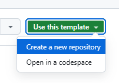
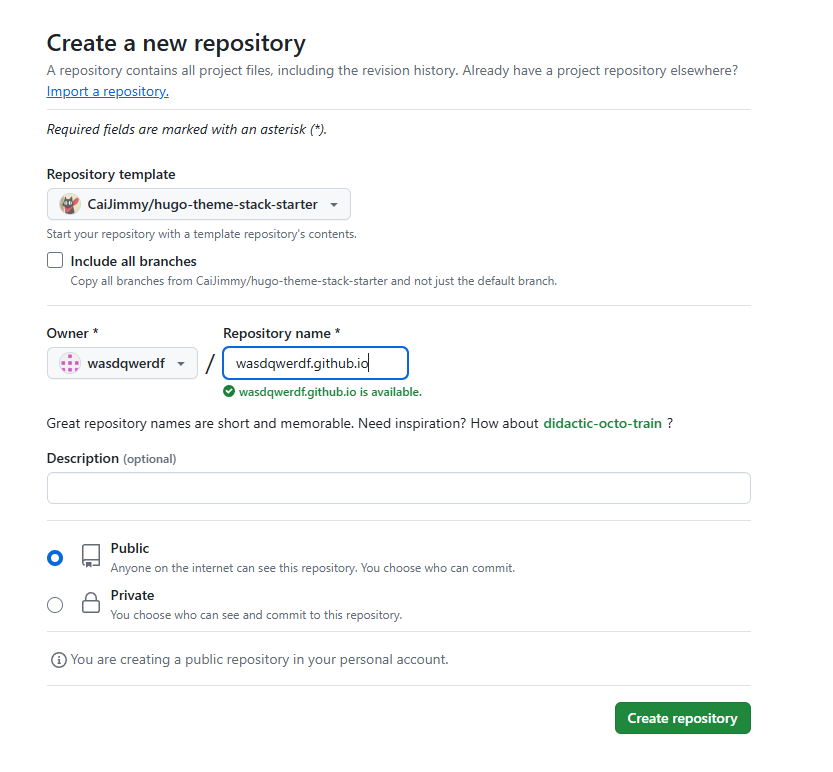
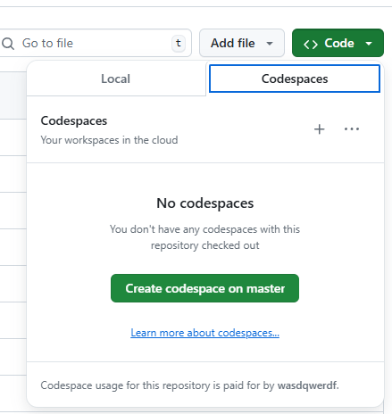
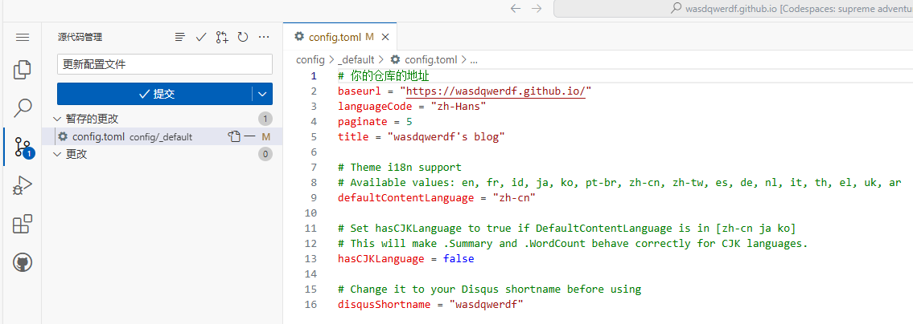
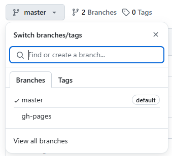
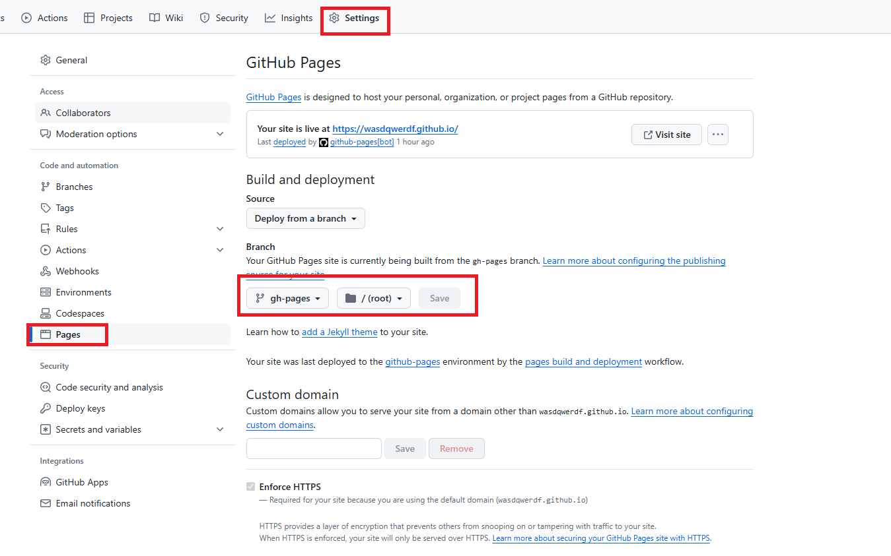

使用Hugo在Github Page上搭建自己的个人博客。

## 使用Hugo Theme Stack Starter Template快速创建博客仓库
打开[Hugo Theme Stack Starter Template](https://github.com/CaiJimmy/hugo-theme-stack-starter)，点击`Use This Template`按钮。


填写仓库信息，仓库名为`用户名.github.io`，然后点击`Create repository`按钮，等待仓库创建并初始化。


点击`Code`按钮，再点击`Create codespace on master`按钮创建Web Vscode编程环境


修改`config/_default/config.toml`文件，然后把更改加到暂存里面，点击`提交`按钮，回到仓库首页，等待Github Actions运行成功(1分钟内)。
```toml
# 你的仓库的地址
baseurl = "https://wasdqwerdf.github.io/"
languageCode = "zh-Hans"
paginate = 5
# 名称
title = "wasdqwerdf's blog"

# Theme i18n support
# Available values: en, fr, id, ja, ko, pt-br, zh-cn, zh-tw, es, de, nl, it, th, el, uk, ar
# 汉化
defaultContentLanguage = "zh-cn"

# Set hasCJKLanguage to true if DefaultContentLanguage is in [zh-cn ja ko]
# This will make .Summary and .WordCount behave correctly for CJK languages.
hasCJKLanguage = false

# Change it to your Disqus shortname before using
disqusShortname = "wasdqwerdf"
```



等待出现分支`gh-pages`



点击`Settiings`-->`Pages`-->将原本的`master`分支改成`gh-pages`分支，目录选择根目录`/`，点击`Save`按钮保存设置。因为`master`分支是我们的源代码，`gh-pages`分支是hugo生成的内容。如果不这样选，访问博客地址时显示的`master`分支的`README.md`文件。
