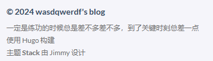
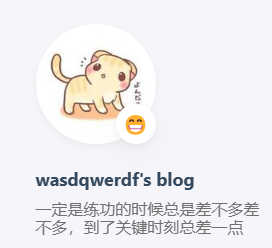
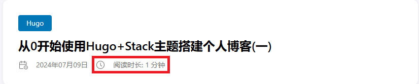
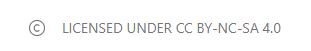
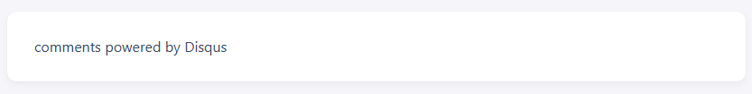
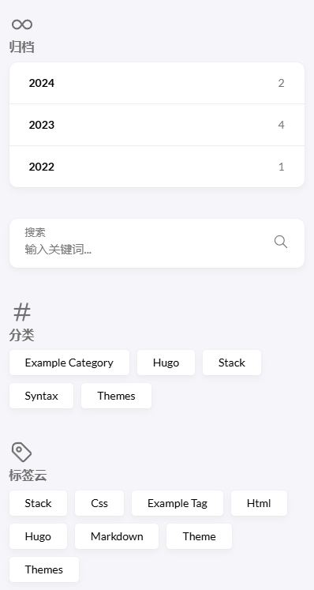
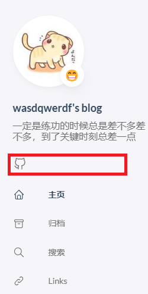
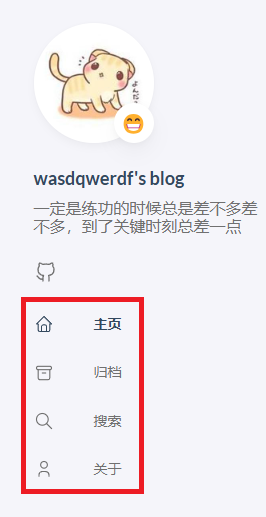

## Stack主题配置

`config/_default/params.toml`文件中的配置

### Footer(页脚)
最底部的内容，最后两行是汉化后的效果
```toml
[footer]
# 创建年份 如果是2024年之前，就会显示©20XX-2024
since = 2024
# 自定义文件，支持HTML
customText = "一定是练功的时候总是差不多差不多，到了关键时刻总差一点"
```
<p align="center">
    
</p>

### Sidebar(侧边栏)
```toml
[sidebar]
# 头像右边的emoji
emoji = "😁"
# 头像下面的语句
subtitle = "一定是练功的时候总是差不多差不多，到了关键时刻总差一点"

# 头像配置
[sidebar.avatar]
# 开启
enabled = true
# 自动调整头像大小
local = true
# 头像所在目录
src = "img/avatar.jpg"
```
<p align="center">
    
</p>

### Article(博客文章)
```toml
[article]
headingAnchor = false
# KaTeX数学支持
math = false
# 阅读时长
readingTime = true

# 许可证
[article.license]
enabled = true
default = "Licensed under CC BY-NC-SA 4.0"
```
<p align="center">
    
</p>
<p align="center">
    
</p>

### Comments(底部评论区)
详细请看官方文档[Comments](https://stack.jimmycai.com/config/comments)
```toml
[comments]
# 关闭
enabled = false
provider = "disqus"
```
<p align="center">
    
</p>

### Widgets(右侧小部件)
安装在配置文件中的定义的顺序显示
```toml
# 归档
[[widgets.homepage]]
type = "archives"
[widgets.homepage.params]
# 要显示的年份数量，设置了最多显示5个
limit = 5

# 搜索
[[widgets.homepage]]
type = "search"

# 文章分类
[[widgets.homepage]]
type = "categories"
# 要显示的分类数量，设置了最多显示10个
[widgets.homepage.params]
limit = 10

# 标签云
[[widgets.homepage]]
type = "tag-cloud"
# 要显示的标签数量，设置了最多显示10个
[widgets.homepage.params]
limit = 10
```

<p align="center">
    
</p>

### 社交
在`config/_default/menu.toml`文件中配置，支持`Github`，`Twitter`和`RSS`
```toml
[[social]]
identifier = "github"
name = "GitHub"
url = "https://github.com/wasdqwerdf"

[social.params]
icon = "brand-github"
```
<p align="center">
    
</p>

## Hugo配置
一些汉化设置
### 左侧边栏

`content/post/_index.md`
```toml
---
menu:
    main:
        # 显示名称
        name: 主页
        # 顺序
        weight: 1
        # 图标
        params:
            icon: home
---
```
`content/page`目录
```toml
# 归档
---
title: "归档"
date: 2024-07-09
layout: "archives"
slug: "archives"
menu:
    main:
        weight: 2
        params: 
            icon: archives
---
```

<p align="center">
    
</p>
